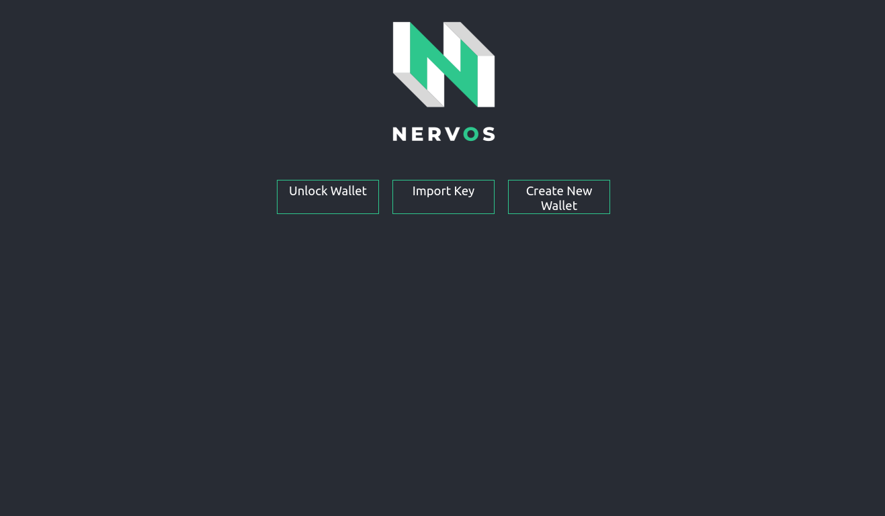
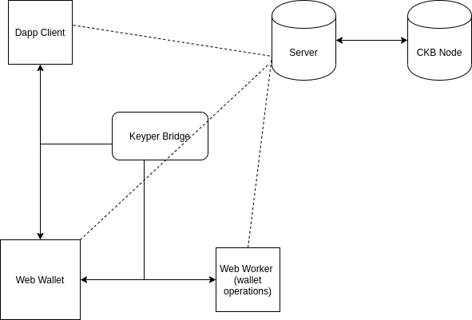
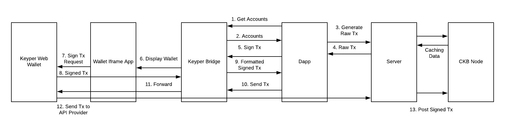

# Table of Contents
- [Introduction](#introduction)
- [Architecture](#architecture)
  - [Overview](#overview)
  - [Client Architecture](#client)
   - [Dapp and Wallet](#dapp-and-wallet)
   - [Keyper Bridge: Manageable Message Channels](#keyper-bridge)
- [Demo](#demonstration-of-functionality)
- [What is Keyper?](#what-is-keyper)
- [Components of Server](#server-description)
- [Setup Instructions](#download-and-build)

# Introduction
This is a demo web application for working with User Defined Tokens (UDTs) on Nervos Network's Layer 1 Blockchain, Common Knowledge Base.

It currently offers the following features:
1. Import Keys
2. Generate addresses
3. Deploy new tokens of different amounts
4. View the token balances of your addresses
5. View the CKByte balances of your addresses

These additional features will be added soon:
1. Issue tokens to a cell locked by fixed rate CKByte exchange rate
2. View tokens available for exchange
3. Exchange CKBytes for token
4. Transfer tokens to other addresses


# Architecture
## Overview

At the highest level, this app is split into two parts: the client and server. The server is not much more than a query service for the client so that the client doesn't have to filter through a bunch of blockchain data on its own. Right now, the server caches blocks and some of their data and provides simply API endpoints for getting app-relevant data from the blockchain. It also generates raw transactions on behalf of the client based on parameters sent by the client (such as the address that will be used to sign the raw transaction). This is because generating the raw transaction requires gathering inputs, which is a query. The server also forwards signed transactions from the client to a CKB node, rather than the client sending them directly. Although there could be some issues with this in a production setting, I prefer it this way for now because it allows for additional logging.

## Client

### Dapp and Wallet
The client side is more complex than the server side and is actually split up into two parts: the Dapp and the Wallet. In the source code, the top level directory called `/client` is where the dapp code exists, while the top level directory called `/wallet` is where the wallet code exists.

The dapp provides the main interface for interacting with tokens, while the wallet provides the key management and transaction signing services.

The wallet is embedded within an iframe and itself has two parts: the wallet UI and the wallet service. The wallet UI is self explanatory (it provides the buttons, the inputs, etc). The wallet service - which is responsible not only for managing keys, but for signing transactions, generating keys, encrypting, decrypting and persisting certain user data in the browser - runs in an isolated web worker where it performs expensive operations.

### Keyper Bridge
So far, I've spoken about the client side application in terms of two separate components: the wallet and the dapp itself. These components are isolated which raises the question: how do they communicate?

Naively, they would just use the Windows Message API. Both the wallet and the dapp post messages to each other and bind a handler to the window's `message` event.

There are two high level issues with this approach, though. The first is that it is difficult to manage the handler(s) as the application grows in sophistication. The second is that the application code and wallet code becomes completely dependent on a single API, making it tedious and difficult to switch to new ways of communicating if the dapp, for example, wanted to add support for desktop wallets communicating via websockets.

To illustrate the first issue, imagine that I have the following possible messages I can send to the wallet: `signTx`, `getAccounts`.

Naively, I might do something like this with the windows message API:

Imagine the messages passed are JSON and that the message data will have at least the following fields: `{source: "wallet", type: "return_accounts" | "return_signTx"}`

Dapp:
```javascript
  // Find the embedded wallet
  let walletFrame = document.getElementById("wallet");

  window.on("message", (e) => {
    if (isJSON(e.data)) {
      let data = JSON.parse(e.data)
      if (data.source === "wallet") {
        switch(data.type) {
          case 'return_signTx':
            // handle the returned tx
            break;
          case 'return_accounts':
            // Handle the returned accounts
            break;
        }
      }
    }
  })

  walletFrame.postMessage(JSON.stringify({data: rawTx, type: "signTx"})

```

This seems fine at first: we just handle all the logic for managing responses from the wallet in a top level event handler like above. It quickly becomes an ineffective approach, though. Imagine I sent two `signTx` requests to the wallet, one after the other, and I needed to submit the FIRST signed transaction to CKB before submitting the SECOND.

In this case, the wallet will send two messages back of the same type: `return_signedTx`. However, the logic I want to use to handle each of these is different, so really I have to add a second layer of filters to determine which logic should be executed as a result of the `message` event: not only does `data.type === "return_signedTx"`, but the response corresponds to the right request.. perhaps implement via message IDs: `data.messageId === request.messageId`.

That solves part of the problem, but I'd still need to figure out how to provide the corresponding routine that would execute when the message IDs match. This could be done via binding `message` event handlers to the window and unbinding them during the callback.

But what if I want to add an additional required field to messages (such as the messageId)? I'd have to change this in every location. Or what if I wanted to change the serialization strategy from JSON to something else? I'd have to change these everywhere. Of course, I could extract these to a set of functions that are called by every message handler in the beginning. That's definitely an improvement... But, again, if I wanted to add another piece of functionality to the message handling workflow (analogous to middleware), I'd have to add it everywhere.


The above summary describes some of the issues that occur as the communication between wallet and dapp becomes more sophisticated if I'm using the message API directly. But there's another *type* of challenge I haven't described: swapping out or adding entire components to this setup.

For example, if I wanted to support a different type of wallet - e.g., a desktop wallet - I'd need to use a different communication channel entirely (for example, websockets). I'd also have to ensure that the message serialization and deserialization worked properly, and if I wanted to support both types of wallets in the same app, I'd have to make sure all of the details about the message structure and semantics are the same.

These are the types of problems solved by `KeyperBridge`. It encapsulates all of this logic for serializing and deserializing messages, filtering through the contents of message channels, matching responses to their corresponding request handlers, etc. It provides easy to use mechansisms for extending and configuring message structure, serialization, functionality supported by the wallet, etc., all while allowing the dapp source code to treat the wallet as if it is just another object within the dapp's scope. Signing transactions with `KeyperBridge` looks like this:


```
let signedTx = await bridge.signTx(rawTx)
// do something with signedTx
```

This is an overview of the architecture:



## Demonstration of Functionality
Right now, the dapp allows you to deploy the UDT type script to your local chain, and also allows deploying tokens with governance locks, generating new accounts, and viewing account balances and UDT balances. Once the issuance script is built on the Keyper and CKB blockchain side, it will make it very easy to list custom tokens and their rates, issue them, and exchange CKBytes for UDTs.

Here is a visual demo of some of these functions:

### Deploy Token


### Import Private Key
 

### Create New Account


### Sign Transaction Workflow



# What is Keyper
 Coming soon

# Server Description
 Coming soon

# Download and Build
  `git clone --recurse-submodules https://github.com/WilfredTA/token_mint`
  
## Setup Server
  `cd token_mint/server/deps/ckb-js-toolkit-contrib`
  `npm i && npm run build`
  `cd token_mint/server/deps/ckb-miscellaneous-scripts`
  `cargo install moleculec`
  `make all-via-docker`
  `cd token_mint/server`
  `npm i && npm run build`
  
Create a `.env` file in your server directory and add the following example contents to it. Make sure to replace any paths with your relevant paths. The two demo private keys correspond to keys pre-loaded with native ckbytes on ckb nodes initialized in developer mode:
```
SECP_CODE_HASH=0x9bd7e06f3ecf4be0f2fcd2188b23f1b9fcc88e5d4b65a8637b17723bbda3cce8
DEMO_PRIV_KEY_1=0xd00c06bfd800d27397002dca6fb0993d5ba6399b4238b2f29ee9deb97593d2bc
DEMO_PRIV_KEY_2=0x63d86723e08f0f813a36ce6aa123bb2289d90680ae1e99d4de8cdb334553f24d
PATH_TO_CONTRACTS=~/Nervos-dev/token_mint/server/deps/ckb-miscellaneous-scripts/build/
PATH_TO_CKB_DB=/home/tannrallard/Nervos-dev/ckb-dev/data/db
```
  
## Setup Client
  `cd token_mint/client/deps/keyper_bridge`
  `npm i && npm run build`
  `cd token_mint/client`
  `npm i`
  
## Setup Wallet
  `cd token_mint/wallet/deps/keyper_web_wallet`
  `npm i`
  `cd packages/wallet && npm i && npm run build`
  `cd token_mint/wallet && npm i`
  
# Start application
1. First, in the `server` directory, if you have already run the app before or your local ckb node already has data, you can execute the reset script `npm run reset`. Make sure that the directories in your `.env` file are correct
2. Start your local CKB node and miner
3. Start server by `npm run start` in `server` directory
4. Then navigate to the wallet directory and `npm start`
5. Then navigate to client directory and `npm start`

The above setup and start instructions should work, but if you have problems with the submodules, you can get them manually and please add an issue informing me that the instructions here do not work as-is.

# Disclaimer

This is meant for demonstration purposes only. The source code has not undergone a security review.

Having said that, I highly *encourage* experimenting with the app, or playing around with the web wallet setup and/or keyper-bridge in your own **toy** projects!
